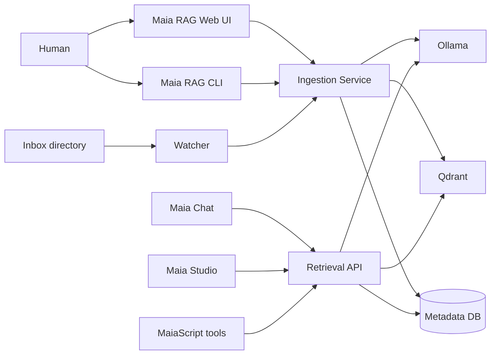
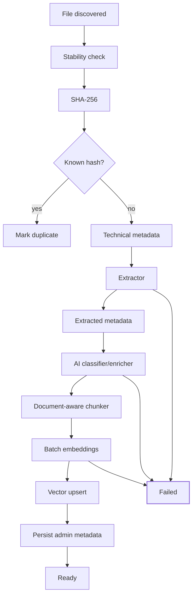

# Maia RAG Architecture

## 1. Purpose

Maia RAG is an autonomous knowledge ingestion and retrieval service. Its design goal is that a human can add useful knowledge by merely dropping files into an inbox. Manual metadata remains possible, but must never be mandatory for normal ingestion.

## 2. Architectural principles

1. **Local first** — Ollama, Qdrant and the metadata database can run entirely on premises.
2. **Maia Chat is a client** — Maia RAG has no dependency on Maia Chat.
3. **Automatic by default** — classification, metadata enrichment and collection suggestion are machine-assisted.
4. **Provenance matters** — technical, extracted, AI-inferred and manual metadata are logically distinct.
5. **Document-aware processing** — PDFs, prose and source code do not share one naive chunking strategy.
6. **Replaceable adapters** — embedding model, LLM, vector store, reranker and extractors must be swappable.
7. **Observable ingestion** — every document has explicit lifecycle state and errors are recoverable.
8. **Deterministic identity** — content hashes prevent accidental duplicate corpus growth.

## 3. Context diagram



## 4. Ingestion pipeline



### Metadata layers

- **Technical:** hash, filename, MIME, size, timestamps, page count.
- **Extracted:** title/author/year when physically present in document metadata or parsed text.
- **AI inferred:** domains, tags, summary, probable project, document type, entities, confidence.
- **Manual:** human corrections and overrides. Manual values take precedence but never destroy provenance.

A later schema should store metadata values as `{value, source, confidence, model, timestamp}` rather than flattening them.

## 5. Processing states

`discovered -> queued -> extracting -> classifying -> chunking -> embedding -> indexing -> ready`

Terminal/error states: `duplicate`, `failed`, `quarantined`, `deleted`.

## 6. Storage responsibilities

### Qdrant

Stores chunk vectors and retrieval payload sufficient for filtering and citation:

- documentId
- chunkId/index
- text
- filename
- page/section or line range
- language
- document type
- domains/tags
- project

### SQLite/PostgreSQL

Stores operational truth:

- documents and versions
- jobs and stages
- collections
- metadata/provenance
- users/ACLs in later releases
- processing metrics
- index/embedding versions

SQLite is selected for v0.1. PostgreSQL is the recommended migration target for multi-user or multi-worker deployments.

### Original file store

Originals are retained under immutable document IDs so citations can resolve back to source artifacts.

## 7. Retrieval pipeline

v0.1:

```text
question -> embedding -> vector top-N -> threshold -> top-K -> context -> LLM -> answer + citations
```

Target architecture:

```text
question
  ├── semantic/vector retrieval
  └── lexical retrieval
          ↓
        fusion
          ↓
       reranker
          ↓
 context budgeter
          ↓
         LLM
```

Hybrid search is particularly important for code identifiers, error codes, API names and exact technical terms.

## 8. Chunking strategy

v0.1 provides paragraph-aware prose chunking and line-preserving source-code chunks. v0.2 should introduce:

- PDF/DOCX: heading/section/page-aware chunks.
- Markdown: heading hierarchy.
- HTML: semantic DOM blocks.
- Source code: Tree-sitter AST chunks around functions/classes/methods with imports and symbol metadata.
- LaTeX/Jupyter: structure-aware adapters.

Chunk size should ultimately be token-based, not character-only.

## 9. AI classification contract

Classification should return strict JSON and include confidence. It should never invent bibliographic facts. Unknown values should be explicit nulls or empty arrays.

Suggested logical output:

```json
{
  "documentType": "academic-paper",
  "language": "en",
  "title": null,
  "authors": [],
  "year": null,
  "domains": [{"name":"computational-modeling","confidence":0.93}],
  "keywords": ["simulation","machine learning"],
  "programmingLanguages": [],
  "frameworks": [],
  "probableProject": null,
  "summary": "...",
  "confidence": 0.89
}
```

Low-confidence classification never blocks ingestion; it contributes to the Knowledge Health review queue.

## 10. Versioning and reindexing

Every document should eventually record:

- extractorVersion
- classifierModel + promptVersion
- chunkerVersion
- embeddingModel + dimensions
- vectorIndexVersion

Changing the embedding model requires re-embedding the affected corpus. Keeping these fields makes migrations explicit and automatable.

## 11. Future code graph

For repositories, Maia RAG can later maintain a secondary graph describing symbols, imports, calls, inheritance and file relationships. Retrieval can then combine vector evidence with structural code navigation.
